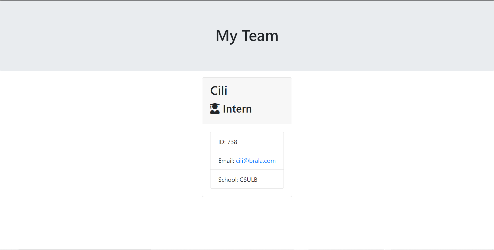

# EmployeeSummary
A visual approach to adding employee data, this application renders and displays to the user 3 different types of employees: Engineers, Interns, and Managers. They are displayed in a card format, each with distinct properties.

## Technolgies
Node.js is used to execute the actual program. HTML comprises the front end. The npm module "inquirer" is used to prompt the user for questions about which employee they are adding to the database.

## Challenges
Determining whether or not the write file method should be asynchronous or synchronous. Ultimately, I decided to make it synchronous in order to lock everything until the write function finishes executing. This ensures that our employees will be added and the input for the user will not be contaminated.

## Usage
Run the command "node app.js" in your preferred IDE/text editor that has node.js installed. Enter values for each prompt. When the input is done, open the team.html file to see the employee data.

## Screenshot

* Deployed Application:
* Repo Link: 